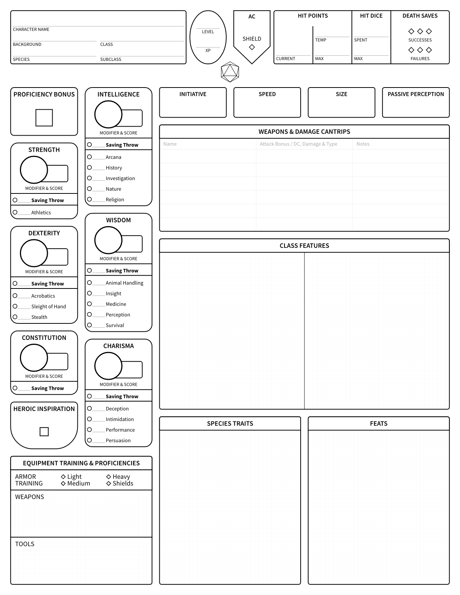
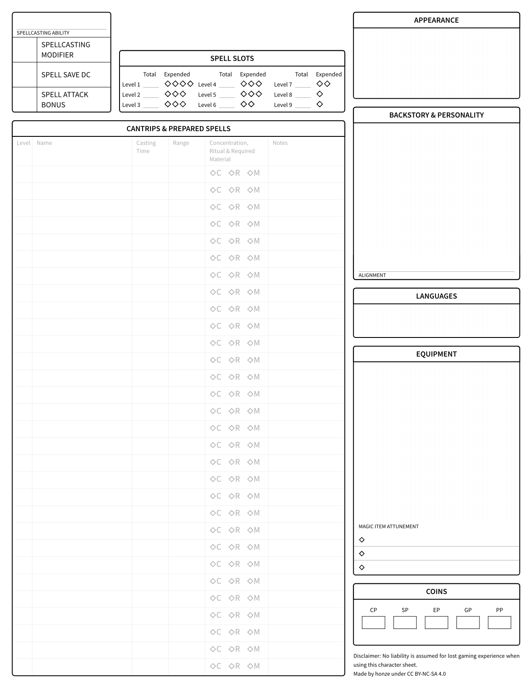

# dnd-character-sheet

This is a character sheet for Dungeons & Dragons (2024, 5.5e, or SRD 5.2) set in typst.

## PDF Downloads

| Language    | Format |
| ----------- | ------ |
| English     |  [US letter](build/standard/empty/en/us-letter/dnd-character-sheet.standard.empty.en.us-letter.pdf), [A4](build/standard/empty/en/a4/dnd-character-sheet.standard.empty.en.a4.pdf) |
| German      |  [US letter](build/standard/empty/de/us-letter/dnd-character-sheet.standard.empty.de.us-letter.pdf), [A4](build/standard/empty/de/a4/dnd-character-sheet.standard.empty.de.a4.pdf) |

## Other formats
More formats (PNG, SVG) are available in the [build directory](build).

## A preview of the English character sheet in US letter

