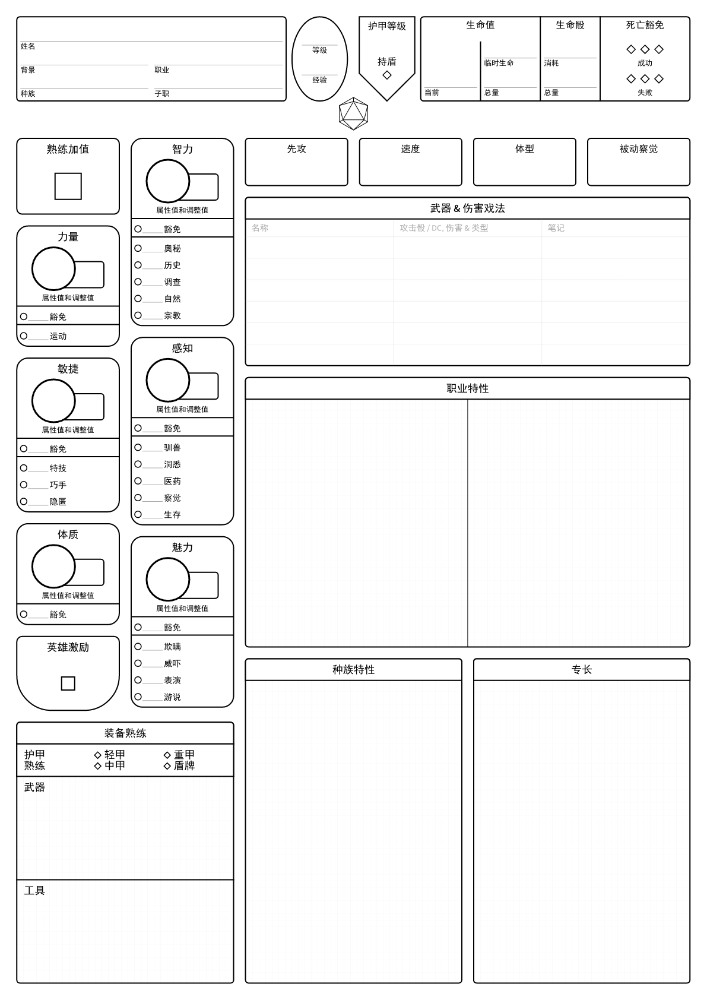
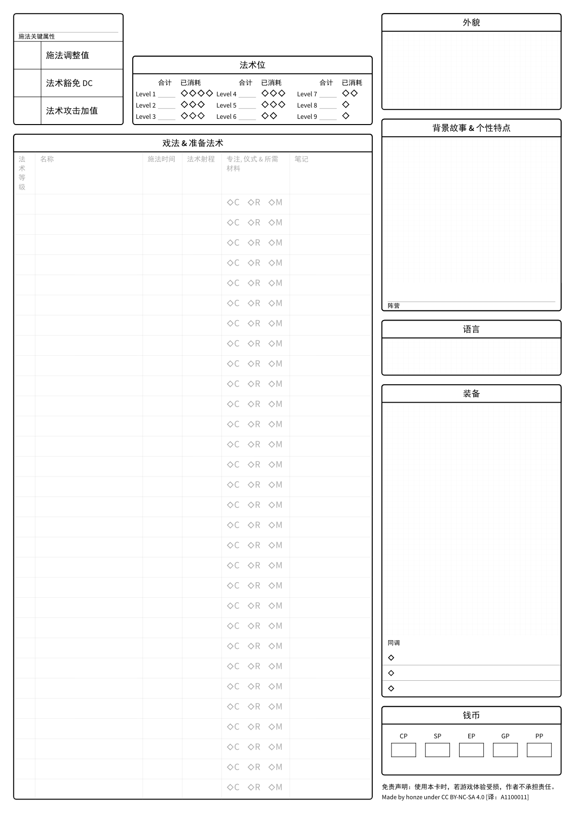

[EN](README-en.md)

# D&D 角色卡

D&D5E typst 角色卡

> fork 自 **[dnd-character-sheet](https://codeberg.org/honze-net/dnd-character-sheet.git)**，原作者 **[honze-net](https://www.honze.net)**

## PDF 下载

| 语言 | 格式 |
| ---- | ---- |
| 中文 |  [US-letter](build/standard/empty/zh/us-letter/dnd-character-sheet.standard.empty.zh.us-letter.pdf), [A4](build/standard/empty/zh/a4/dnd-character-sheet.standard.empty.zh.a4.pdf) |
| 英文 |  [US letter](build/standard/empty/en/us-letter/dnd-character-sheet.standard.empty.en.us-letter.pdf), [A4](build/standard/empty/en/a4/dnd-character-sheet.standard.empty.en.a4.pdf) |
| 德文 |  [US letter](build/standard/empty/de/us-letter/dnd-character-sheet.standard.empty.de.us-letter.pdf), [A4](build/standard/empty/de/a4/dnd-character-sheet.standard.empty.de.a4.pdf) |

## 格式
更多格式见[构建目录](build)。

## A4 中文角色卡预览
 
